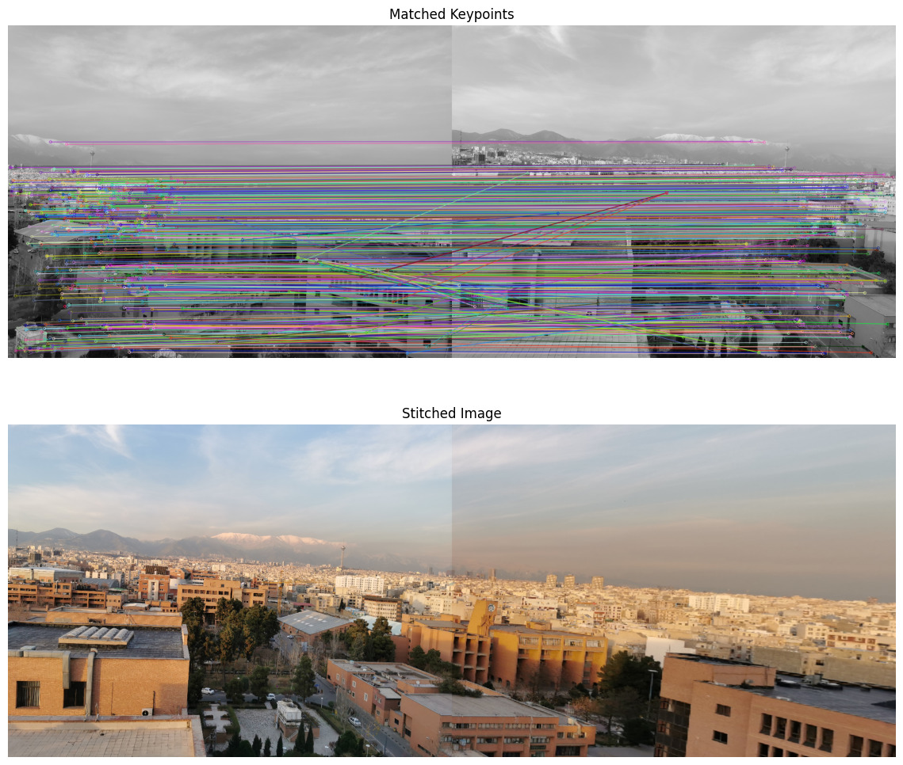

# Panorama
## Overview
This project implements Harris Corner Detector and an image stitching pipeline using SIFT (Scale-Invariant Feature Transform) for feature detection and matching, followed by homography estimation using RANSAC (Random Sample Consensus). The final result is a seamless combination of two images into a single panorama.


## Features
- **Feature Detection and Matching**: Uses SIFT to detect keypoints and match them between two images.
- **Homography Estimation**: Implements RANSAC to compute the best homography matrix that aligns the two images based on the matched keypoints.
- **Image Stitching**: Warps one image onto another using the estimated homography matrix to create a panorama.
- **Visualization**: Provides functions to visualize the matched keypoints and the final stitched image using `matplotlib`.

## Requirements

- Python >= 3.8
- OpenCV (`cv2`)
- NumPy
- Matplotlib

You can install the required libraries using `pip`:

```bash
pip install opencv-python-headless numpy matplotlib
```

## How It Works
### 1. Feature Detection and Matching
The SIFT algorithm detects keypoints in both images and extracts descriptors. These descriptors are then matched using a Brute Force matcher. A ratio test is applied to filter out poor matches.

### 2. Homography Estimation
RANSAC is used to compute the best homography matrix by iteratively selecting random sets of points and calculating the transformation matrix that maximizes the number of inliers.

### 3. Image Stitching
The homography matrix is used to warp one image onto the coordinate space of the other, effectively stitching them together into a single panorama.

### 4. Visualization
The matched keypoints and the final stitched image are displayed using matplotlib.

## License
This project is licensed under the CC0 License. See the [LICENSE](./LICENSE) file for details.

## Contributing
Contributions are welcome! Please feel free to submit a pull request or open an issue to discuss any changes.

